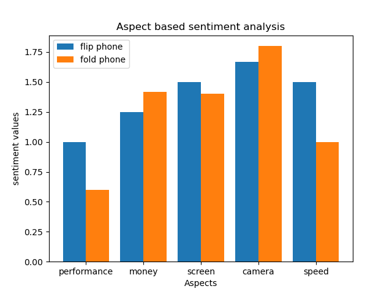

# Amazon Product Reviews Sentiment Analysis

This program is designed to perform aspect-based sentiment analysis on Amazon product reviews. The program utilizes several technologies including Spacy, NLTK, and the Word2vec pre-trained model to scrape, preprocess, and analyze the text. The goal is to compare and contrast the sentiments of two Amazon product reviews based on five aspects: performance, camera quality, screen display, battery life, and value for money.

## Requirements

To use this program, you will need to have Spacy and NLTK installed on your system, as well as the pre-trained Word2vec model. The positive-words.txt and negative-words.txt files should also be stored in the working directory. You will need to import several Python libraries including Spacy, Gensim, and Scikit-learn.

## Setup

The sentiment_analysis.py script provides a class called sentiment_analysis for performing sentiment analysis on input text. To use the class, simply pass your input text to the constructor of the class. The class will then automatically process the text and store the sentiment scores for each of the five aspects. The class provides a dictionary called sent_dict that can be accessed to retrieve the sentiment scores for each aspect.

The add method is provided for adding new words and their associated sentiment scores to the analysis. This method takes two arguments: a word and its sentiment score. If the word is associated with one of the five aspects, the method will add the sentiment score to the list of sentiment scores for that aspect.

The feature_sentiment method is used internally by the sentiment_analysis class to compute the sentiment scores for each aspect based on the input text. This method uses a combination of heuristics and dependency parsing to identify the sentiment words and their associated aspects.

The visualize_data script is provided for visualizing the sentiment scores using a pie chart. To use this script, simply pass the sent_dict dictionary to the plot_pie_chart function.

## Output

The output of the sentiment_analysis.py script is a dictionary called sent_dict, which contains the sentiment scores for each of the five aspects.

## Example Visualizations

